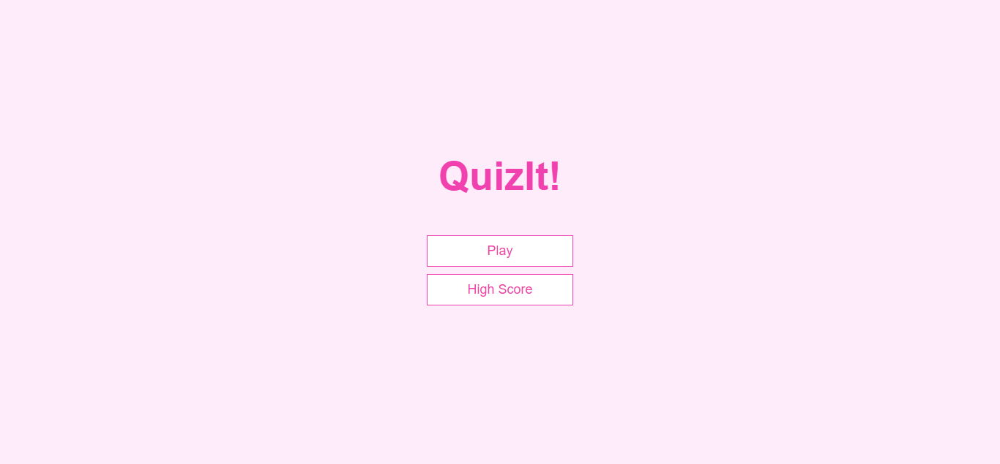
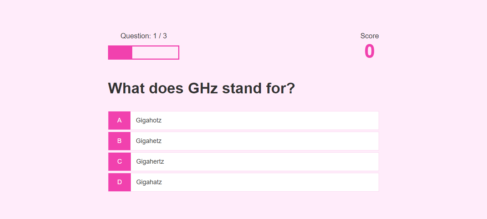
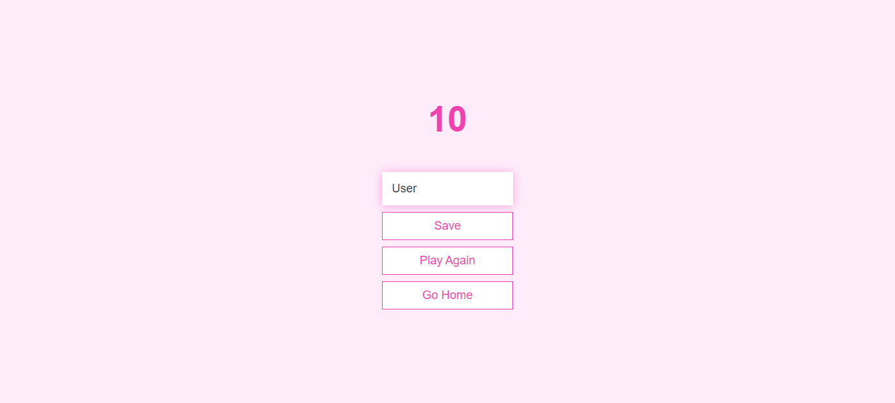
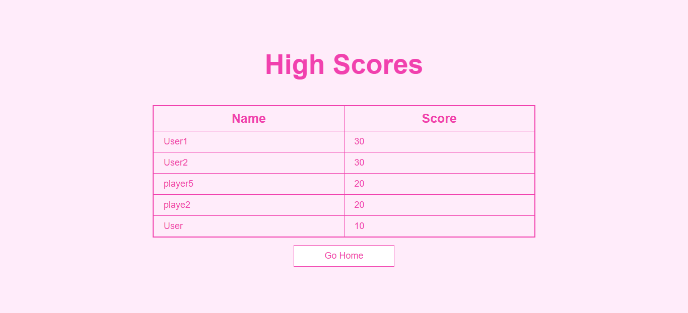

# Project Title:

QuizIT - Quiz Application


## 1. Project Description: 

Quiz App Project 

A user can play the multiple choice quiz game, where individual scores are stored in local storage. 

At the end, a list of scores showing the highest score is displayed. 


## 2. Tech Stack: 

- HTML 
- CSS 
- JavaScript
- IDE: VSCode


## 3. Installation:

i. Clone the git repo

```
https://github.com/sanjivanisharma/QuizIT---Quiz-Application.git
```

ii. Open project folder

iii. Explore


## 4. How To Use:

i. Run index.html on live server in VSCode


## 5. Demo










## 6. Adapted from: 

UDEMY Course Name: Build a Quiz App with HTML, CSS, and JavaScript

Created by James Quick

URL: https://www.udemy.com/course/build-a-quiz-app-with-html-css-and-javascript/
